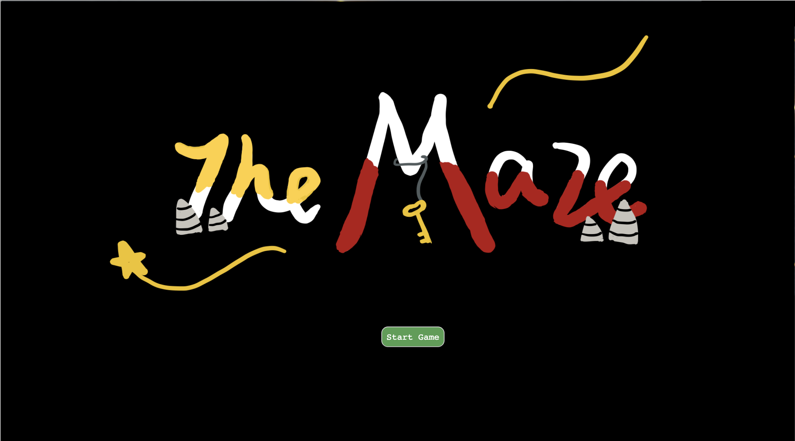
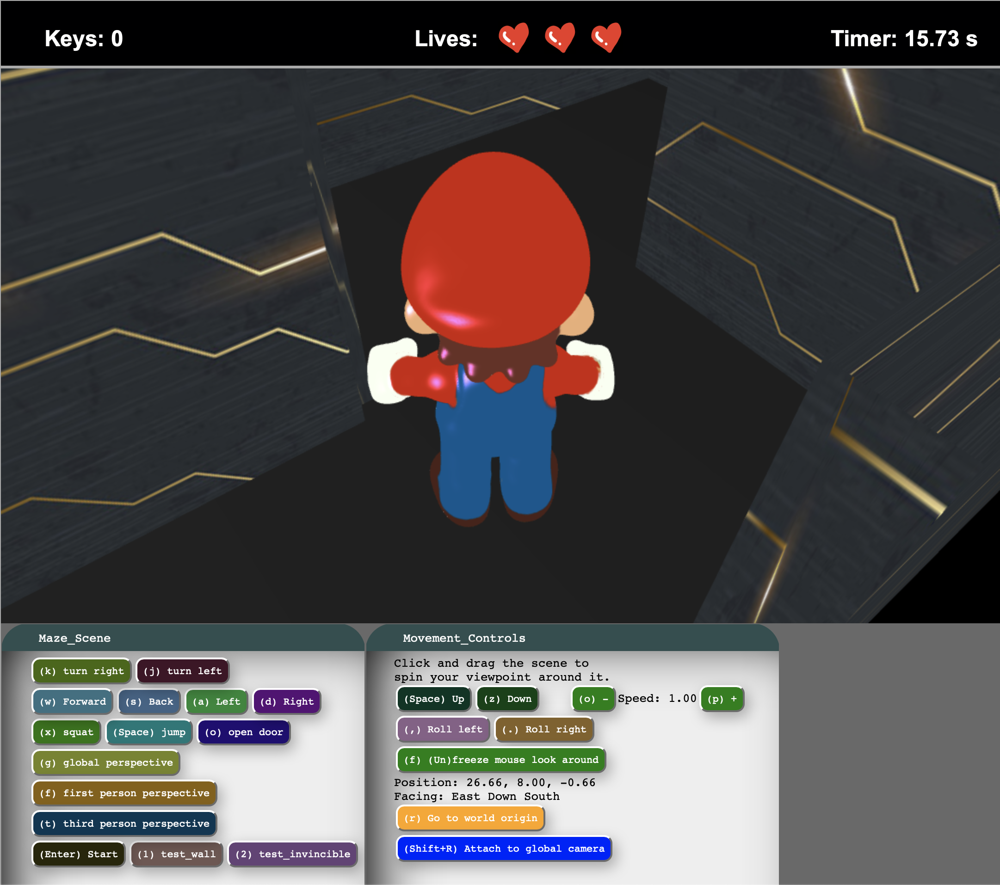
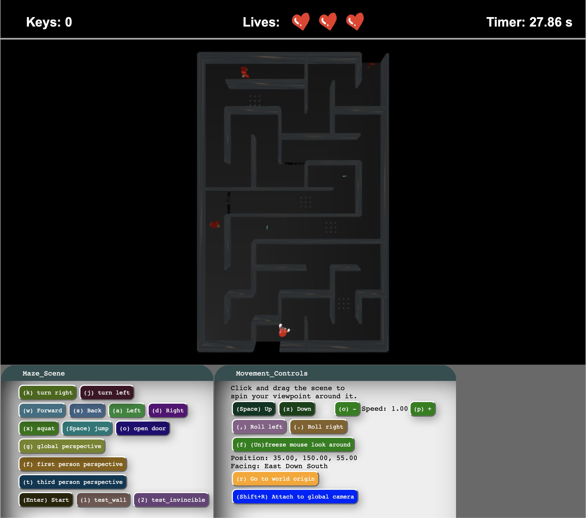

# The Maze by Maze Squad

### Overview



Our **maze game** allows people to use keystrokes to walk in a 3D maze, in which the player needs to find keys, open gates, and find the exit. When exploring in the maze, the player will meet moving monsters and obstacles which could possibly wound player. For each round, the player has three lives, and there is a timer to record how much time the player spent to finish the maze. There are three perspectives: first-person, third person, and global perspectives, each has different advantages when playing. Also, sounds are played when the player is performing different actions. 

### How to Play

First, download the project, and run 'chmod u+x host.command' under this directory in terminal on your mac.
Then, './host.command' in terminal, or double click the host.command file to run the host.
Now, you can play the game in http://localhost:8000 (or other address shown in your terminal that you ran the host.command) from your browser.

To start the game, first press the Start Game button. 
6 keys are used for basic operations:
  ```
  W - Foward 
  A - Back 
  S - Left
  D - Right
  X - Squat
  Space - Jump
  J - Turn left
  K - Turn right
  O - Open door
  ```
  
3 keys are used to change perspectives:
  ```
  F - First-person perspective
  T - Third-person perspective
  G - Global perspective
  ```
Third Person Perspective:


Global Perspective:


Once the player has a move, the timer is triggered to record the time. 

The player has to keep away from the monsters and goes across the obstacles. Every time the player runs into a monster or an obstacle, the player will lose one live, and the player will die if all there is no live avaiable. 

During the game, the player has to find all the keys and open the doors. 
`Notice: there are two keys in the maze, each for its **correponding** door, you need to figure out which ones are paired.` 

There is a red flag placed at the exit, as soon as the player touch the flag, the timer is stopped and the win scene will pop up.

### Advanced Features

- **Collision Detection** - Collision detection with walls and obstacles, prevent player entering the wall, and decrease health if the player hit obstacles.
- **OBJ Models** - 3D models in .obj formats, including Mario character, gates, keys, and flag, are imported with texture mapping and animations. 

### Individual Roles

#### Wenxuan Liu

- Wrote the animation for individual obstacle which is constructed by many cubes scaled and translated proportionally by time.
- Wrote the destination detection method to activate win scene when character goes out of the maze.
- Drew and wrote the UI interfaces in HTML including the beginning, die, and win scenes.
- Added the timer, health, and key number UI, and wrote the algorithm to update timer.
- Modified the obj models import methods, and collected all the models and constructed them into the appropriate textures, proportions and positions.
- Added music and FX to the game, so that there are corresponding sounds when the character is win, wounded, walking, opening gates, and died.

#### Ziyan Wang

- Build the prototype of the maze.
- Implement the movement control of the player (WASD, jump/squat, turn left/right)
- Add collision detection with the wall and obstacles (spikes, monster and door)
- Implement the first person, third person, and global camera perspectives.
- Build the health system for player and update the health for each frame.
- Refined the movement of the monster in the maze.
- Refined the animation of door opening.

#### Yuan Shen

- Constructed the model of the monsters and implemented the movement of their arms and legs.
- Wrote the basic algorithm for the movement of monsters. 
- Wrote the key-and-door method that detects if the player is qualified to open the door (the player have to pick up the corresponding key, be closer enough to the door, and hit the "open door" key).
- Refined the appearance of the obstacles using 9 individual obstacles and placed them into the maze.
- Added textures to the walls and the floor, and modified the appearance of the keys. 
- Implemented two test mode: 
  * Invincible mode where the player will not lose any live.
  * Walk-through mode where the player can go through all the walls and doors.

### Resource Citation

- **models** - all from TurboSquid.com

  **Mario** https://www.turbosquid.com/FullPreview/Index.cfm/ID/549984

  **Gate** https://www.turbosquid.com/FullPreview/Index.cfm/ID/1366455

  **Flag** https://www.turbosquid.com/FullPreview/Index.cfm/ID/974692

  **Key** https://www.turbosquid.com/FullPreview/Index.cfm/ID/448201

- **Sounds** - all from Logic Pro X FX library

